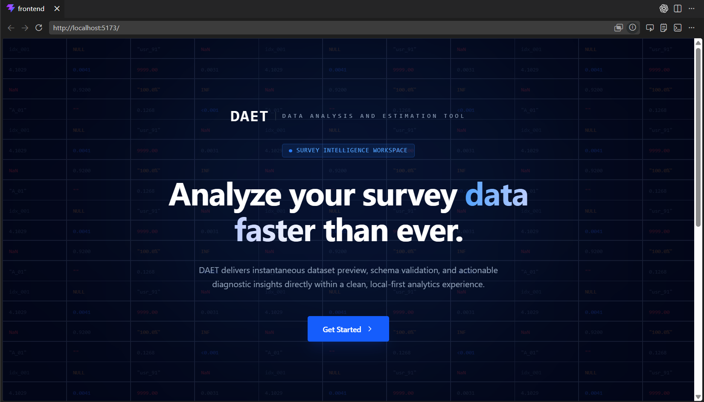
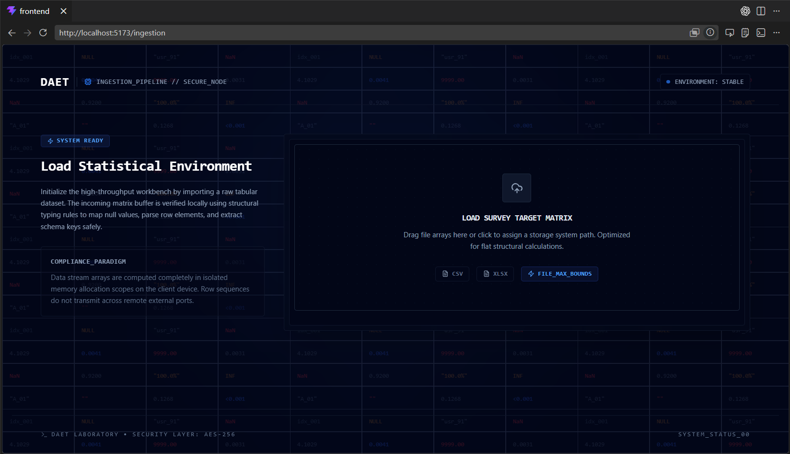

DAET - Data Analysis Estimation Tool
==================================

AI-Augmented Survey Data Cleaning, Validation, Weighting, Versioning & Reporting Platform.

Badges: FastAPI · React · SQLite · Pandas · NumPy · Recharts · Ollama · Versioning · Encryption · Compression

---

Why this project
-----------------
- Purpose: make survey datasets production-ready with reproducible preprocessing, validation, weighting, versioning and AI-assisted interpretation.
- Targets: data engineers, backend/full‑stack engineers, technical reviewers and recruiters evaluating system and algorithmic maturity.
- Real needs addressed: schema inference, cleaning, statistical weighting, audit trails, LLM-assisted explanations, and exportable reports.
- Design goal: deterministic statistical pipelines + controlled LLM assistance for interpretability and speed.

# Project snapshots:




# User Sequence Diagram(Till what have been implemented):


Core Capabilities
-----------------

| Module | Capability | Status |
|---|---:|:---:|
| Dataset Upload | CSV / XLSX ingestion, metadata extraction | ✅ Implemented |
| Schema Inference | Column typing, basic constraints | ✅ Implemented |
| Dataset Preview | Tabular preview + column stats | ✅ Implemented |
| Missing Value Cleaning | Mean/median/mode/KNN, per-column strategies | ✅ Implemented |
| Outlier Detection | IQR, Z‑score, Winsorization | ✅ Implemented |
| Duplicate Handling | Detection / deduplication policies | ✅ Implemented |
| Validation DSL | Rule authoring & conditional checks | 🟡 Partial |
| Weight Estimation | Survey weighting engine | ✅ Implemented |
| Analytics Dashboard | Charts + summaries | 🟡 Partial |
| AI Recommendation Engine | Statistical + heuristic recommendations | ✅ Implemented |
| AI Explanation Layer | LLM-driven explanations (Ollama) | 🟡 Partial |
| AI Cache | Cached AI outputs for repeatability | ✅ Implemented |
| Dataset Versioning | File-backed version history, metadata | ✅ Implemented |
| Rollback | Restore prior dataset versions | ✅ Implemented |
| Compression | Archive + compressed snapshot support | ✅ Implemented |
| Encryption | At-rest encryption workflows | ✅ Implemented |
| Archive Management | Archive, retrieve, lifecycle policies | ✅ Implemented |
| PDF Reporting | Report generation (template + export) | 🟡 Partial |
| Pipeline Execution | Orchestrated pipelines + audit logs | ✅ Implemented |
| Audit Logs | Operation traceability & metadata | ✅ Implemented |

Tech Stack
----------

| Layer | Stack |
|---|---|
| Backend | FastAPI, Pydantic, SQLite, Pandas, NumPy, SciPy, Statsmodels |
| Frontend | React (Vite), Tailwind CSS, Recharts, Lucide |
| AI | Ollama, Phi3 (model runner) - hybrid deterministic + LLM workflows |
| Storage | File-backed versioning, compression, encryption, checksum integrity |
| Testing & CI | Pytest (backend), Playwright (e2e), basic CI templates |

System Architecture (conceptual)
--------------------------------

Frontend
  ↓
API Layer (FastAPI)
  ↓
Service Layer (upload, cleaning, validation, weighting)
  ↓
Statistical Engines (Pandas, SciPy, Statsmodels)
  ↓
AI Layer (Ollama + deterministic engines)
  ↓
Storage & Versioning (file snapshots + metadata)
  ↓
Reports / Exports / Archive

Backend Highlights
------------------
- Modular FastAPI routes and service-layer separation.
- Reusable utility modules for DataFrame operations and validation logic.
- Statistical recommendation engine (deterministic) with audit trails.
- AI orchestration that combines deterministic outputs with controlled LLM prompts.
- File-backed dataset lineage and version-aware reporting.
- Compression and encryption workflows integrated into lifecycle operations.
- Pipeline‑ready architecture with explicit audit logging.

Dataset Version Flow
--------------------

Raw Upload → v1 Cleaning → v2 Outlier Handling → v3 Validation → v4 Weight Estimation → Reports / Archive / Export

- Rollback to any snapshot supported via file-backed versions and metadata.

AI Layer Overview
-----------------

| AI Layer | Purpose |
|---|---|
| Recommendation Engine | Deterministic statistical suggestions and rules |
| Explanation Engine | Ollama-based, human-readable explanations for changes |
| Module AI | Module-specific assistance (validation, weighting hints) |
| AI Cache | Persisted outputs to ensure repeatable results |

- Hybrid approach: deterministic statistical logic first; LLMs used for explanations and contextual summaries.

Frontend Highlights
-------------------
- Dataset preview with schema and quick-stats.
- Dashboard analytics and charting (Recharts).
- Panels for missing values, outliers, duplicates, validation rules, and weight estimation.
- AI insight panels with cached recommendations and explanations.
- Version tracking and report/export surfaces.

Project Structure (top-level)
----------------------------

backend/
frontend/
services/
routes/
utils/
ai_cache/
datasets/
logs/

Current Maturity
----------------

| Area | Status |
|---|---:|
| Architecture Hardening | In Progress |
| Validation DSL | Partial |
| Weighting Correctness | Improved (iterating) |
| AI Consolidation | In Progress |
| DB + File Sync | Planned |
| Performance Scaling | Planned |
| Testing Expansion | Planned |

Key Engineering Learnings
-------------------------
- File-backed dataset lineage simplifies rollback and auditability.
- Deterministic preprocessing (stats + rules) is essential before LLM use.
- Survey weighting requires explicit, testable transformations and diagnostics.
- AI orchestration benefits from caching and controlled prompts for reproducibility.
- Clear route/service separation improves testability and recruitment evaluation.
- Version-aware reporting avoids silent destructive edits.

Run locally (quick)
-------------------

Backend (Python / venv)

```bash
python -m venv .venv
source .venv/Scripts/activate  # PowerShell: .venv\Scripts\Activate.ps1
pip install -r backend/requirements.txt
uvicorn backend.main:app --reload
```

Frontend

```bash
cd frontend
npm install
npm run dev
```

Ollama (if using local model)

```bash
ollama serve
ollama run phi3
```

Future Improvements
-------------------

| Focus | Priority |
|---|---:|
| Persistence normalization (DB sync) | High |
| Validation DSL hardening & testing | High |
| Full AI cache reuse & eviction policies | Medium |
| Background task workers (Celery/Redis) | Medium |
| RBAC / Auth (fine-grained) | High |
| Larger dataset optimization (parquet/partitioning) | Medium |
| CI/CD & test coverage expansion | High |

Footer
------

Built to explore survey-grade analytics, statistical processing, AI-assisted interpretation, and version-aware data engineering workflows.

## This Project is still under minor improvements and bug/error clearances so kindly don't clone the project and run, 
Thank you for your understanding!