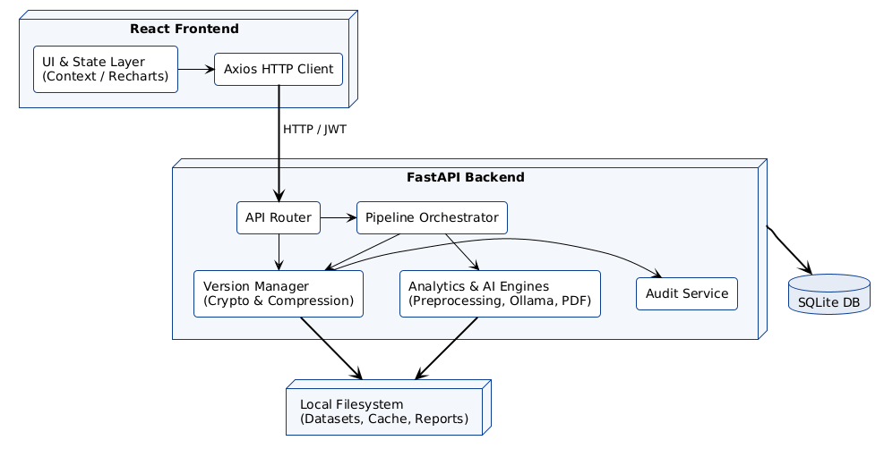
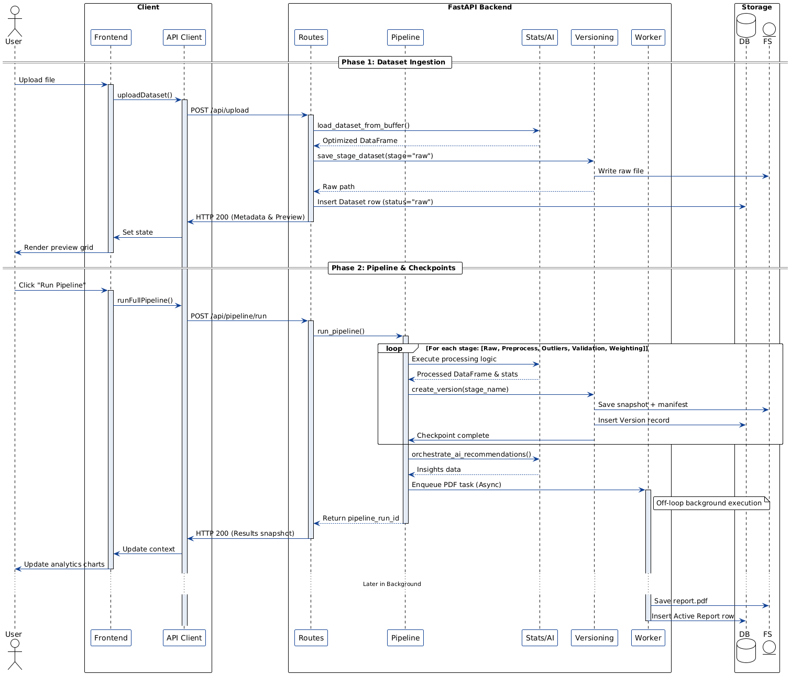
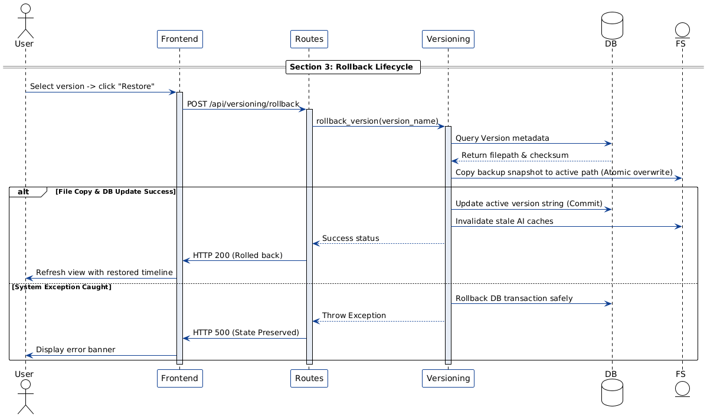
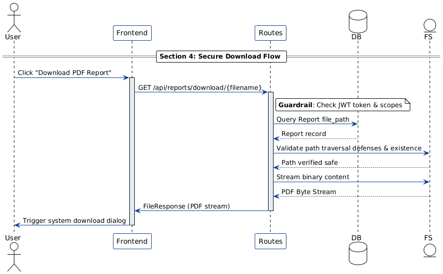
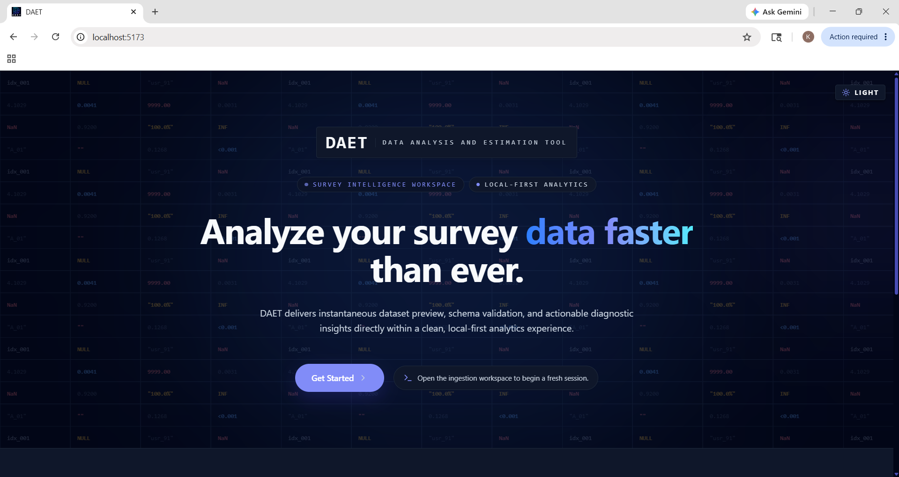
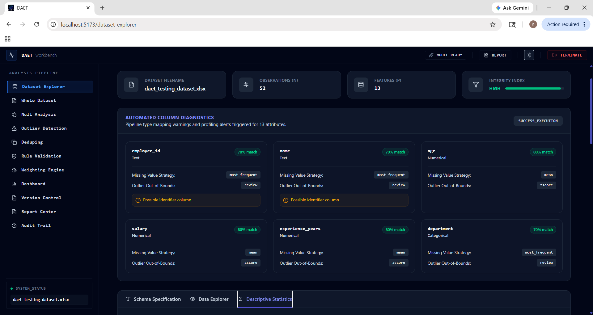
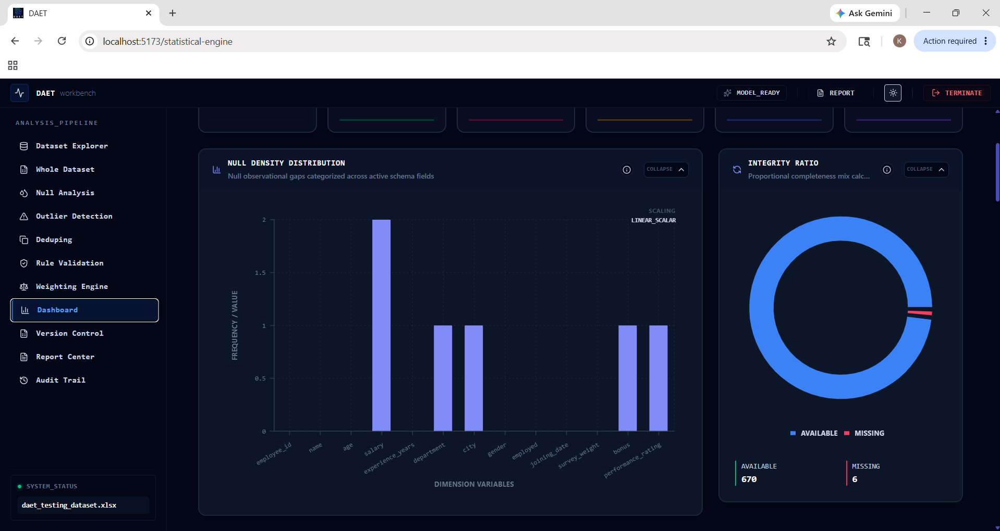
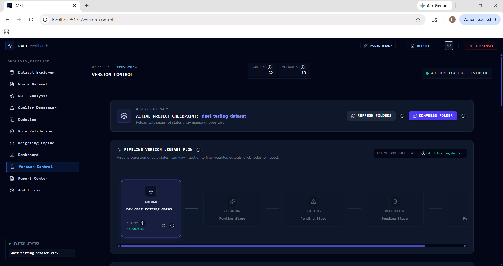

# DAET - AI Augmented Survey Data Processing & Analytics Platform

DAET (Data Analysis & Estimation Tool) is a full‑stack app (React + FastAPI) for ingesting and cleaning survey data, running validations and IPF demographic weighting, generating explainable AI insights, tracking versioned dataset lineage, and producing audited exports

---

## Submodule Documentation

Detailed implementation notes, directory breakdowns, dependencies, and execution logs are located in their respective module folders:

* **[Frontend Documentation](./frontend/README.md)**: React components, state contexts, custom hooks, charting interfaces, and Playwright E2E tests.
* **[Backend Documentation](./backend/README.md)**: FastAPI router structure, Pydantic DTOs, Pandas cleaning engines, SQLite schemas, and Pytest coverage.

---

## Key Features

| Feature | Short description |
| --- | --- |
| Dataset preprocessing & cleaning | CSV/XLSX ingest, preview, impute (mean/median/mode/const/interpolate), dedupe |
| Outlier detection | IQR and Z-score filters with visual indicators |
| Validation DSL | Cross-field conditional rule engine for data checks |
| Weight estimation (IPF) | Iterative Proportional Fitting (raking) for demographic calibration |
| AI recommendations | Automatic cleaning suggestions based on dataset metrics |
| Explainable AI | Ollama or Gemini-generated explanations with SQLite caching |
| Version lineage & rollback | DAG view of versions and single-click rollback |
| PDF reports | Automated audited PDF exports summarizing actions and scores |
| Secure storage | AES encryption, compression, and HMAC-signed temporary links |
| Audit logs | SQLite-tracked operation logs with timestamps and row counts |
| Responsive UI & themes | Light/Dark responsive dashboard with Recharts and Framer Motion |

----

## System Architecture


---

## End to End Sequence Diagram




---

## UI Showcase & Screen Previews
 
 
 


---

## Tech Stack Overview

| Component | Technology | Purpose |
| :--- | :--- | :--- |
| **Frontend Core** | React 19 (Vite) | Declarative UI, utilizing the React Compiler for render optimization. |
| **Frontend Styling** | TailwindCSS v4 | Custom utility CSS and HSL styling variables with Dark Mode support. |
| **State & Navigation** | Zustand & React Router v7 | Global client state management and nested dashboard routing. |
| **Visualizations** | Recharts & React Flow | Interactive SVG charts and lineage DAG canvases. |
| **E2E Testing** | Playwright | Multi-browser automated end-to-end interface testing. |
| **Backend Core** | FastAPI & Uvicorn | High-throughput async ASGI web server and routing. |
| **Data Calculations** | Pandas, NumPy & SciPy | Matrix operations, raking algorithms, and statistical profiles. |
| **Database & ORM** | SQLite & SQLAlchemy v2 | Audit logging, project registries, and task tracking databases. |
| **AI LLM Engine** | Ollama (`phi3`) & Gemini API | Asynchronous local model client with Gemini 2.5 Flash API fallback for recommendations. |
| **Reports** | ReportLab | Programmatic compiling of high-fidelity PDF analytics summaries. |
| **Cryptography** | Pyca/Cryptography | AES encryption at rest and SHA-256 checksum verifications. |
| **Backend Testing** | Pytest | Analytical validation and unit testing of APIs and engines. |

---

## Repository Structure

```
DAET/
├── backend/            
├── frontend/           
├── documents/                        
├── LICENSE             
└── README.md        
```

---

## ⚙️ Getting started (quick)

Clone the repo and enter the project folder:
```bash
git clone <REPO_URL>
cd DAET
```

Backend (run from `backend`):
```bash
python -m venv venv
# Windows:
.\venv\Scripts\Activate.ps1
# macOS/Linux:
source venv/bin/activate
pip install -r requirements.txt
uvicorn main:app --reload --port 8000
```

Frontend (run from `frontend`):
```bash
npm install
npm run dev
```

### AI Configuration (Ollama & Gemini API)

DAET supports a dual-AI engine configuration for generating explainable insights:
* **Local Mode (Ollama)**: Uses local running model weights (default: `phi3`).
* **Cloud Mode (Google Gemini)**: Automatically falls back to Google's **Gemini 2.5 Flash API** if Ollama is offline or when deployed to production (e.g. on Render).

**Setup local Ollama:**
1. Download Ollama and start the service:
   ```bash
   ollama serve
   ollama run phi3
   ```

**Setup Gemini API Failover (Local & Deployed):**
1. Create a `.env` file in the project root directory.
2. Add your Gemini API key:
   ```env
   GEMINI_API_KEY=your_gemini_api_key_here
   ```
   *(For production deployments, configure `GEMINI_API_KEY` under the Render Environment Variables tab).*

Replace `<REPO_URL>` with this repository's clone URL or use your local copy.
