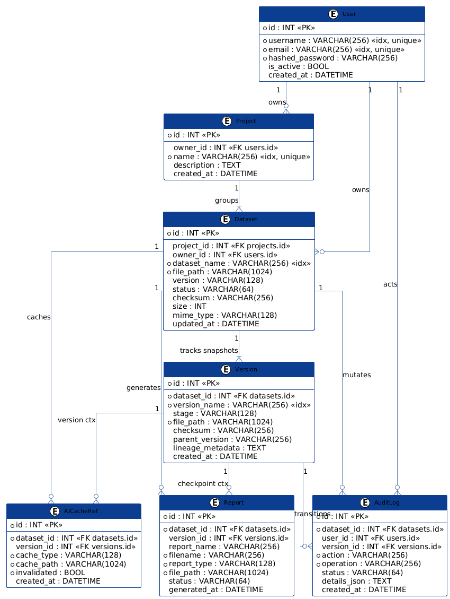

# DAET Backend (Data Analysis & Estimation Tool)
A FastAPI service for ingesting and cleaning survey data, running validations and IPF weighting, generating explainable AI outputs, and managing versioned, auditable dataset snapshots.

---

## Core backend features

| Feature | Summary |
| --- | --- |
| Ingestion & schema | CSV/XLSX streaming, type inference and profiling |
| Cleaning & imputation | Vectorized imputation (mean/median/mode/const/interpolate) and dedupe |
| Outlier detection | IQR and Z-score anomaly detection |
| Validation DSL | Cross-field conditional rule engine for data checks |
| Weighting (IPF) | Iterative Proportional Fitting (raking) for demographic calibration |
| AI & caching | Ollama & Gemini explainers with SQLite caching |
| Versioning (DAG) | Version lineage with atomic, single-click rollbacks |
| Async PDF reporting | Background ReportLab PDF generation |
| Secure storage | AES encryption, compression, HMAC-signed temporary links |
| Reconciliation audit | DB↔disk consistency scans and automated healing |

---

## Backend tech stack

| Component | Tech | Notes |
| --- | --- | --- |
| Framework | FastAPI (Python 3.10+) | ASGI web framework
| Data | Pandas, NumPy | Vectorized dataframe ops
| Database | SQLite, SQLAlchemy | Lightweight relational store
| Stats | SciPy, Statsmodels | Statistical algorithms
| LLM / AI | Ollama (phi3) & Gemini API | Local Phi3 with Gemini 2.5 Flash API fallback
| Reporting | ReportLab, Pillow | PDF & image generation
| Validation | Pydantic v2 | DTOs and schema validation
| Excel | openpyxl | Excel workbook parsing
| Security | cryptography | AES, HMAC, SHA-256
| Async | FastAPI BackgroundTasks | Background job execution
| Testing | Pytest | Unit/integration tests

---

## API reference (grouped)

All endpoints accept and return JSON unless noted.

### Upload & datasets

| Method | Endpoint | Purpose |
| --- | --- | --- |
| `POST` | `/api/upload` | Upload CSV/XLSX, infer schema, save snapshot |
| `POST` | `/api/datasets/full-preview` | Return dataset preview and metadata |

### Cleaning & outliers

| Method | Endpoint | Purpose |
| --- | --- | --- |
| `POST` | `/api/clean/missing-values` | Impute missing values (mean/median/mode/const/interpolate) |
| `POST` | `/api/duplicates/process` | Detect and process duplicate records |
| `POST` | `/api/outliers/detect` | Identify outliers (IQR / Z-score) |
| `POST` | `/api/outliers/apply` | Apply outlier filters and commit new version |

### Validation & statistics

| Method | Endpoint | Purpose |
| --- | --- | --- |
| `POST` | `/api/validation/suggest` | Auto-suggest validation rules for columns |
| `POST` | `/api/validation/run` | Run DSL validation rules and return failures |
| `POST` | `/api/statistics/profile` | Compute summaries, missing ratios, correlations |
| `POST` | `/api/statistics/estimate` | Run IPF / raking weighting calculations |

### AI & reports

| Method | Endpoint | Purpose |
| --- | --- | --- |
| `POST` | `/api/ai/recommendations` | Produce cleaning recommendations |
| `POST` | `/api/ai/explanations` | Generate LLM explainers (Ollama / Gemini fallback) |
| `POST` | /api/report/generate | Enqueue PDF report (returns `task_id`) |
| `GET` | `/api/report/status/{task_id}` | Poll report build status |
| `GET` | `/api/reports/download/{filename}` | Download completed PDF report |

### Versioning & storage

| Method | Endpoint | Purpose |
| --- | --- | --- |
| `GET` | `/api/versioning/versions` | List dataset versions |
| `GET` | `/api/versioning/latest` | Get latest version metadata |
| `GET` | `/api/versioning/compare` | Compare two versions |
| `GET` | `/api/versioning/manifest/{version_name}` | Get version manifest |
| `POST` | `/api/versioning/rollback` | Roll back to historical version |
| `POST` | `/api/versioning/compress` | Compress dataset file on disk |
| `POST` | `/api/versioning/decompress` | Decompress a zipped dataset file |
| `POST` | `/api/versioning/encrypt` | Encrypt dataset file at rest |
| `POST` | `/api/versioning/decrypt` | Decrypt dataset file |
| `POST` | `/api/versioning/download-token` | Generate signed temporary download token |
| `GET` | `/api/versioning/download` | Download dataset using token |
| `POST` | `/api/versioning/archive/version` | Archive & encrypt a specific version |
| `POST` | `/api/versioning/archive/old` | Archive older snapshots |

### Utilities & logs

| Method | Endpoint | Purpose |
| --- | --- | --- |
| `GET` | `/api/reconcile` | Run DB↔disk reconciliation audit |
| `GET` | `/api/logs/{dataset_name}` | Retrieve audit logs for a dataset |

---

## ER-Diagram


## Backend - setup & run (quick)

Prerequisites
- Python 3.10+
- Ollama (optional, for local LLM) and/or Google Gemini API Key (for cloud fallback)

Steps (copy-paste)

1) Open a terminal and go to the backend folder:
```bash
cd backend
```

2) Create and activate a virtual environment:
```bash
# Windows PowerShell
python -m venv venv
.\venv\Scripts\Activate.ps1

# macOS / Linux
python -m venv venv
source venv/bin/activate
```

3) Install Python dependencies:
```bash
pip install -r requirements.txt
```

4) Run the development server:
```bash
uvicorn main:app --reload --port 8000
```
API docs: http://localhost:8000/docs

### AI Configuration (Ollama & Gemini API)

The backend supports a dual-AI engine configuration for generating explainable insights:
* **Local Mode (Ollama)**: Uses local running model weights (default: `phi3`).
* **Cloud Mode (Google Gemini)**: Automatically falls back to Google's **Gemini 2.5 Flash API** if Ollama is offline or when deployed to production (e.g. on Render).

**Setup local Ollama:**
1. Download Ollama and start the service:
   ```bash
   ollama serve
   ollama run phi3
   ```

**Setup Gemini API Failover (Local & Deployed):**
1. Create a `.env` file in the project root directory.
2. Add your Gemini API key:
   ```env
   GEMINI_API_KEY=your_gemini_api_key_here
   ```
   *(For production deployments, configure `GEMINI_API_KEY` under the Render Environment Variables tab).*

Run tests:
```bash
pytest
```

Notes
- Use the PowerShell commands on Windows and `source` on Unix-like shells.
- Activate the virtual environment in each new terminal before running the server or tests.

---
